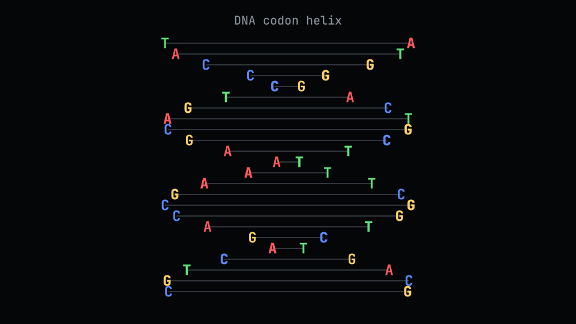
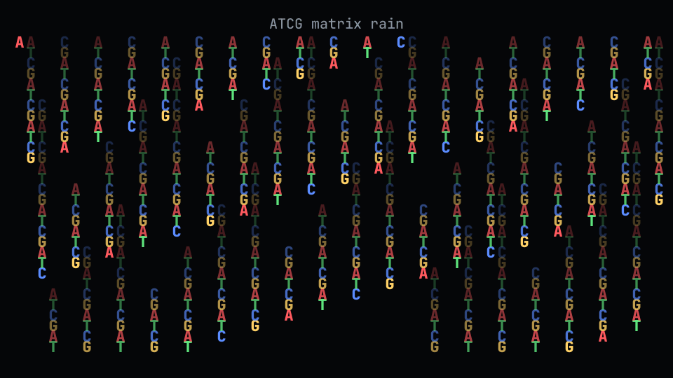

# bio-terminal

Biology-themed terminal animations for people who wanted `cmatrix`, but with nucleotides.

`bio-terminal` is a zero-dependency Rust CLI with DNA/RNA matrix rain and codon-aware rotating helices.

## Preview

### Rotating codon helix



### ATCG matrix rain



## Install

From crates.io:

```bash
cargo install bio-terminal
```

From source:

```bash
git clone https://github.com/Jakeelamb/bio-terminal.git
cd bio-terminal
cargo run -- helix --dna
```

## Run

```bash
bio-terminal          # DNA helix
bio-terminal h r      # RNA helix
bio-terminal m d      # DNA matrix
bio-terminal matrix -r
```

`helix --dna` is the default.

The codon wheel is still in the codebase, but it is experimental and disabled in the default build:

```bash
cargo run --features codon-wheel -- codon
```

## Controls

| Key | Action |
| --- | --- |
| Left / Right | Cycle animations |
| Up / Down | Change speed; Down reaches `0.00x` freeze |
| `+` / `-` | Change visual scale |
| `c` | Cycle color palettes |
| `f` | Toggle focus mode and hide the footer |
| `q` or `Ctrl-C` | Quit cleanly |

## CLI

Modes:

- `h`, `helix`: rotating double helix.
- `m`, `matrix`: nucleotide rain.
- `codon`: optional experimental codon wheel, available with `--features codon-wheel`.

Alphabets:

- `d`, `dna`, `-d`, `--dna`: use `ATCG`.
- `r`, `rna`, `-r`, `--rna`: use `AUCG`.

Long-form help:

```bash
bio-terminal -h
```

## Modes

- `matrix --dna`: ATCG rain.
- `matrix --rna`: AUCG rain.
- `helix --dna`: rotating double helix using generated sense codons and complementary basepairs.
- `helix --rna`: RNA version using `A-U` and `C-G`.
- `codon`: optional experimental RNA codon wheel, available with `--features codon-wheel`.

## Color Palettes

Press `c` while running to cycle:

- `classic`
- `base colors`
- `ice`
- `fire`
- `mono`

In `base colors`, bases stay stable across every view:

| Base | Color |
| --- | --- |
| `A` | Red |
| `C` | Blue |
| `G` | Yellow |
| `T` / `U` | Green |

## Design

- No external crates.
- Rust-only runtime.
- Uses ANSI escape sequences and terminal raw mode.
- Restores terminal state on normal quit.
- No test-only rendering path; the same code draws the shipped animations.

## License

MIT
